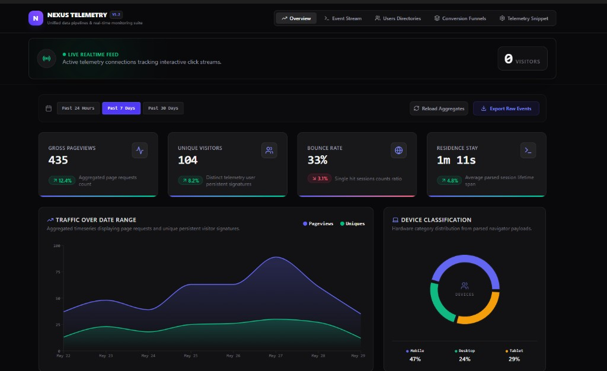
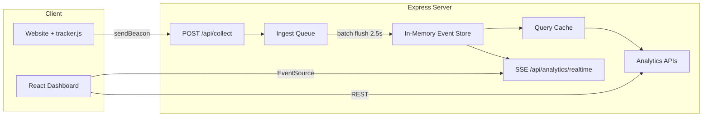

<div align="center">

# Nexus Telemetry

**A production-grade, full-stack analytics platform for real-time web telemetry, conversion funnels, and user session exploration.**

[](https://analytics-dashboard-668971334330.europe-west2.run.app)
[](https://www.typescriptlang.org/)
[](https://react.dev/)
[](https://expressjs.com/)
[](LICENSE)

[Live Demo](https://analytics-dashboard-668971334330.europe-west2.run.app) · [Report Bug](https://github.com/mkkbun/analytics-dashboard/issues) · [Request Feature](https://github.com/mkkbun/analytics-dashboard/issues)

<br />

<a href="https://analytics-dashboard-668971334330.europe-west2.run.app">
  
</a>

<br />

*Click the screenshot to open the live deployment on Google Cloud Run.*

</div>

---

## About

**Nexus Telemetry** is a self-hosted analytics dashboard that gives you product-level insight without third-party tracking services. It ships with a lightweight JavaScript tracker, a real-time event pipeline, and a polished dark-mode UI — deployed live on **Google Cloud Run**.

Built as a full-stack TypeScript application, it demonstrates modern patterns for event ingestion, Server-Sent Events (SSE), query caching, and interactive data visualization.

### What you can do

- **Monitor traffic in real time** — live visitor count and streaming event feed via SSE
- **Analyze performance** — pageviews, bounce rate, session duration, and top pages
- **Explore users** — per-visitor timelines with browser, device, and country metadata
- **Measure conversions** — configurable multi-step funnels (page paths + custom events)
- **Embed anywhere** — drop-in `<script>` tracker under 2 KB with SPA support
- **Export data** — download raw events or page aggregates as CSV

---

## Live Demo

**Try it now:** [https://analytics-dashboard-668971334330.europe-west2.run.app](https://analytics-dashboard-668971334330.europe-west2.run.app)

| Tab | What to explore |
|-----|-----------------|
| **Overview** | KPI cards, traffic time-series chart, device/browser/country breakdowns |
| **Event Stream** | Real-time telemetry feed — enable the simulator under Telemetry Snippet |
| **Users Directories** | Individual visitor profiles and session timelines |
| **Conversion Funnels** | E-commerce funnel: Home → Products → Cart → Checkout → Success |
| **Telemetry Snippet** | Copy the embed code, toggle traffic simulator, fire sandbox events |

> The live instance is seeded with 30 days of demo data and runs on Google Cloud Run (europe-west2).

---

## Features

| Module | Description |
|--------|-------------|
| **Overview Dashboard** | KPI cards for pageviews, unique visitors, bounce rate, and session duration |
| **Interactive Charts** | Time-series trends plus device, browser, and country breakdowns (Recharts) |
| **Top Pages** | Ranked page performance with views, uniques, avg. time on page, and exit rate |
| **Live Event Stream** | Real-time feed powered by Server-Sent Events (SSE) |
| **Active Visitors** | Live count of sessions active in the last 3 minutes |
| **User Explorer** | Per-user timelines with session history and event details |
| **Conversion Funnels** | Configurable multi-step funnel analysis (page paths or custom events) |
| **Tracking Snippet** | Drop-in `<script>` tag for any website — under 2 KB |
| **CSV Export** | Download raw events or page aggregates for the selected date range |
| **Traffic Simulator** | Built-in synthetic traffic generator for demos and testing |
| **Live Sandbox** | Manually fire test events from the dashboard UI |

---

## Tech Stack

| Layer | Technologies |
|-------|-------------|
| **Frontend** | React 19, TypeScript, Vite 6, Tailwind CSS 4, Recharts, Motion |
| **Backend** | Express 4, TypeScript, batch ingestion pipeline, SSE |
| **Deployment** | Google Cloud Run (europe-west2) |
| **Data layer** | In-memory event store with Redis-style query caching |

> **Note:** Data is stored in memory and seeded with 30 days of realistic demo traffic on startup. Restarting the server resets collected events.

---

## Quick Start

### Prerequisites

- [Node.js](https://nodejs.org/) 18+
- npm

### Run locally

```bash
git clone https://github.com/mkkbun/analytics-dashboard.git
cd analytics-dashboard
npm install
npm run dev
```

Open **http://localhost:3000** — no API keys or environment variables required.

---

## Scripts

| Command | Description |
|---------|-------------|
| `npm run dev` | Start dev server (Vite HMR + Express API on port 3000) |
| `npm run build` | Build frontend and bundle server for production |
| `npm start` | Run production build (`NODE_ENV=production`) |
| `npm run lint` | Type-check with TypeScript |
| `npm run clean` | Remove the `dist/` directory |

---

## Production Deployment

```bash
npm run build
NODE_ENV=production npm start
```

The server listens on **port 3000** and serves the built SPA from `dist/`.

---

## Tracking Your Website

Add this snippet to the `<head>` of any site:

```html
<script src="https://analytics-dashboard-668971334330.europe-west2.run.app/tracker.js" async></script>
```

The tracker automatically:

- Captures pageviews on load and SPA route changes
- Persists user IDs (`localStorage`) and session IDs (`sessionStorage`)
- Parses UTM campaign parameters from the URL
- Sends events via `navigator.sendBeacon` (with `fetch` fallback)

### Custom Events

```javascript
window.nexus.track('add_to_cart', { item: 'Cyber Slate A', value: 149.00 });
```

Events are sent to `POST /api/collect` and appear in the dashboard within ~2.5 seconds.

---

## API Reference

| Method | Endpoint | Description |
|--------|----------|-------------|
| `GET` | `/tracker.js` | JavaScript tracking snippet |
| `POST` | `/api/collect` | Ingest a telemetry event |
| `GET` | `/api/analytics/overview?start=&end=` | Overview metrics and time series |
| `GET` | `/api/analytics/pages?start=&end=` | Top pages with engagement stats |
| `GET` | `/api/analytics/users?start=&end=` | User profiles and event histories |
| `POST` | `/api/analytics/funnels` | Evaluate a conversion funnel |
| `GET` | `/api/analytics/export?type=&start=&end=` | Export events or pages as CSV |
| `GET` | `/api/analytics/realtime` | SSE stream for live events and stats |
| `POST` | `/api/simulator/toggle` | Enable/disable the traffic simulator |
| `GET` | `/api/simulator/status` | Check simulator state |

<details>
<summary><strong>Event payload example</strong></summary>

```json
{
  "type": "pageview",
  "name": "Page View",
  "url": "https://example.com/products",
  "path": "/products",
  "referrer": "https://google.com",
  "userId": "usr_abc123",
  "sessionId": "sess_xyz789",
  "screen": "1920x1080",
  "lang": "en-US",
  "utm": { "utm_source": "google", "utm_medium": "organic" },
  "data": {},
  "timestamp": 1717000000000
}
```

</details>

---

## Architecture



---

## Project Structure

```
analytics-dashboard/
├── server.ts                 # Express API, ingestion pipeline, SSE, tracker
├── docs/
│   └── dashboard-preview.png # README showcase screenshot
├── src/
│   ├── App.tsx               # Main dashboard layout and data fetching
│   ├── types.ts              # Shared TypeScript interfaces
│   └── components/           # Dashboard UI modules
├── index.html
├── vite.config.ts
└── package.json
```

---

## Author

**mkkbun** — [GitHub](https://github.com/mkkbun)

---

## License

This project is licensed under the [Apache License 2.0](https://www.apache.org/licenses/LICENSE-2.0).
